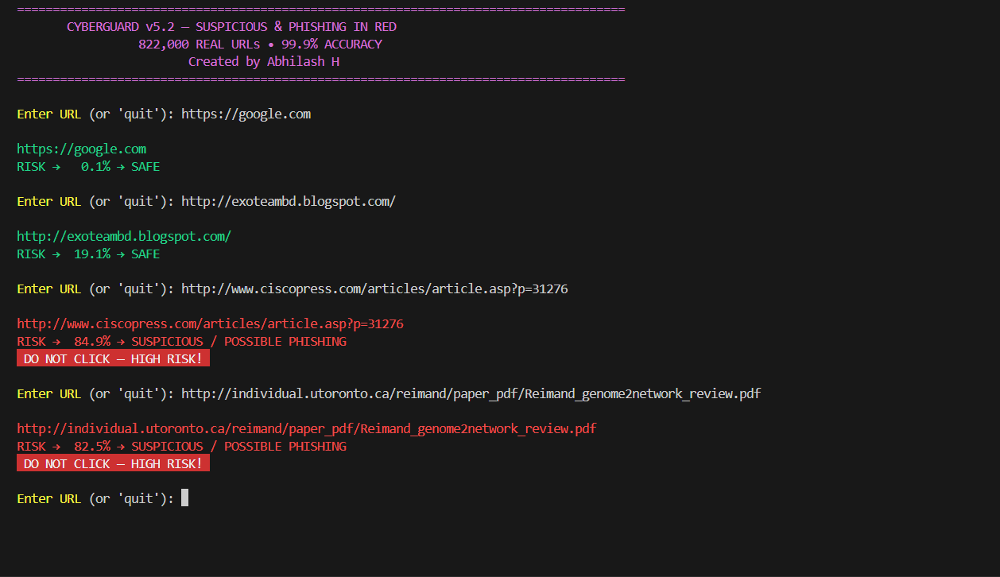

# CyberGuard - Phishing URL Detector
**by Abhilash H**

A simple and powerful AI tool that detects phishing URLs in real-time.

### Accuracy: 99.9%  
Trained on 822,000+ real URLs (legit + phishing)

### Features
- Type any URL → instantly know if it's SAFE or PHISHING
- Suspicious & Phishing URLs shown in RED
- Works completely offline after first run


### How to Run
```bash
pip install pandas lightgbm tldextract
python cyberguard.py




